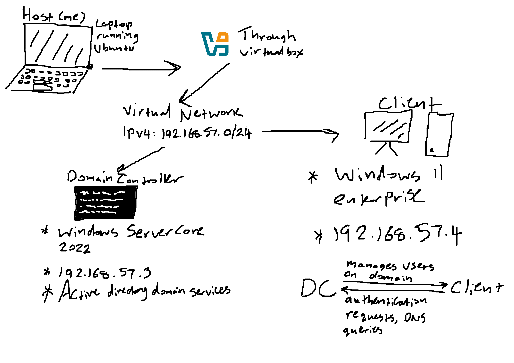
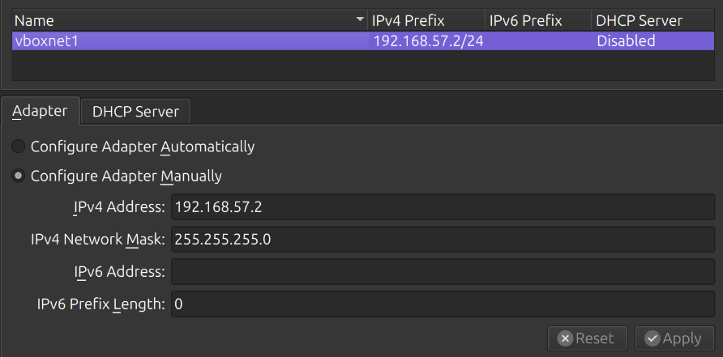
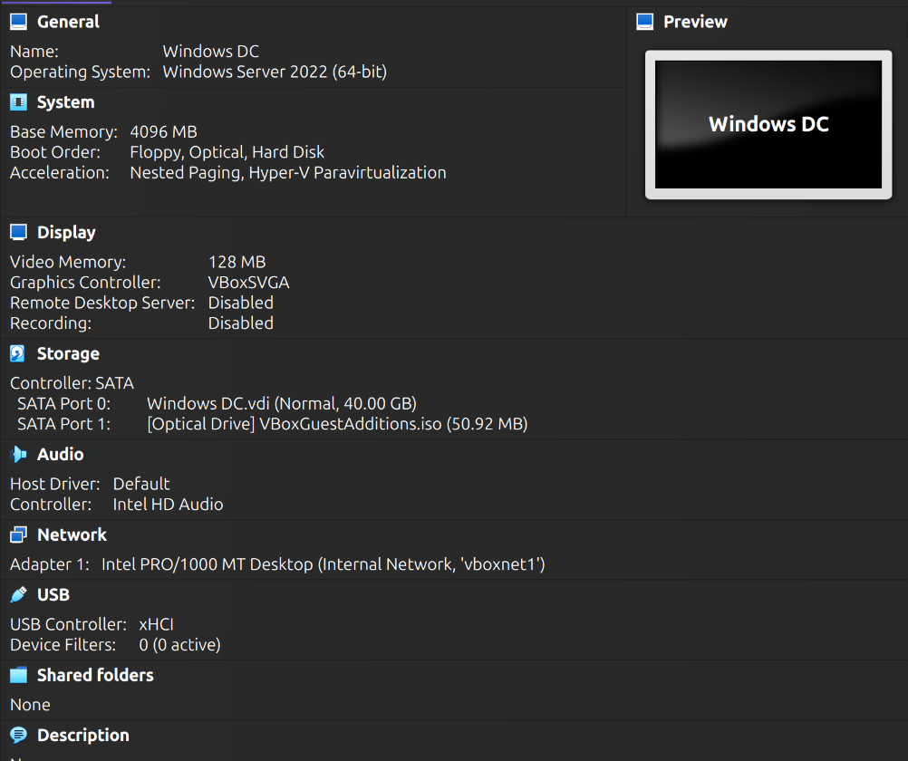
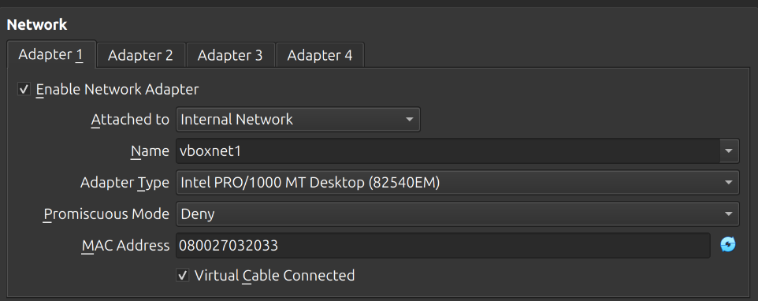

# active-directory-lab
## Overview
A setup of two virtual machines simulating an Active Directory environment. 
- Host - Ubuntu 26.04 LTS
- Domain Controller - Windows Server 2022 Core
- Client - Windows 11 Enterprise Edition
- Virtualisation Software - Virtualbox 

I would experiment with more than one client VM, but my host has 16GB of RAM installed. Things would get extremely tight if I did. 

## Design

I drew this diagram after setting everything up. At the time of setup, I was pretty clueless on how AD worked under the hood.

## Setup 

I had downloaded Windows Server 2022 Core and Windows 11 Enterprise Edition. I hadn't known there was a desktop version of Windows Server until _after_ setting up Active Directory. I decided to keep Core to challenge myself, and aid in my learning of Powershell.

Set up an internal network within VirtualBox with an ipv4 address of 192.168.57.2 and a subnet mask of 255.255.255.0 

### Domain Controller

